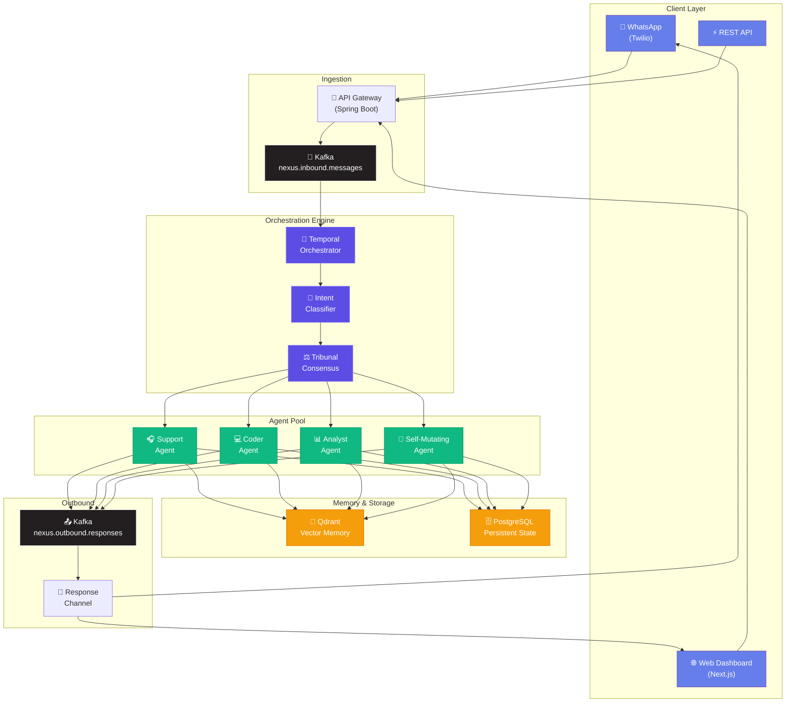

<p align="center">
  
  
  
  
  
  
  
  
</p>

<br/>

<h1 align="center">
  🧠 NEXUS OS
</h1>

<h3 align="center">
  <em>AI Digital Workforce Management System</em>
</h3>

<p align="center">
  A B2B2C Multi-Agent platform that orchestrates AI digital workers through<br/>
  conversational interfaces — WhatsApp, Web, and API.<br/>
  Built with enterprise-grade durability, vector memory, and real-time streaming.
</p>

<p align="center">
  <a href="#-quick-start">Quick Start</a> •
  <a href="#-deep-documentation">Deep Docs</a> •
  <a href="#-architecture">Architecture</a> •
  <a href="#-tech-stack">Tech Stack</a> •
  <a href="#-demo-path-zero-keys">Demo Path</a> •
  <a href="#-team--roles">Team</a> •
  <a href="CONTRIBUTING.md">Contributing</a>
</p>

<p align="center">
  <strong>v0.1 Foundation</strong> — coordination + deep docs + bottom-up backend, frontend, and infra are all in place. The system boots end-to-end without any API keys (deterministic mock providers).
</p>

---

## ✨ What is Nexus OS?

**Nexus OS** is an enterprise multi-agent orchestration platform that lets businesses deploy, manage, and observe AI digital workers at scale. Think of it as a **workforce management system — but for AI agents**.

### Key Capabilities

| Capability | Description |
|:---|:---|
| 🤖 **Multi-Agent Orchestration** | Route tasks to specialized AI agents (support, coding, analysis) via intent classification |
| 🔄 **Durable Workflows** | Temporal-powered execution with automatic retries, timeouts, and saga compensation |
| 🧠 **Vector Memory (RAG)** | Agents remember context via Qdrant vector store with semantic retrieval |
| 📡 **Real-Time Streaming** | Kafka-based event backbone for async, decoupled agent communication |
| 💬 **WhatsApp Native** | End-users interact with AI workers through WhatsApp via Twilio webhooks |
| 🔮 **Self-Mutating Agents** | Agents can dynamically evolve their own capabilities at runtime |
| 📊 **Visual Orchestration** | React Flow canvas for real-time agent graph visualization |

---

## 🏗️ Architecture



---

## 🛠️ Tech Stack

<table>
<tr>
<td><strong>Layer</strong></td>
<td><strong>Technology</strong></td>
<td><strong>Purpose</strong></td>
</tr>
<tr>
<td>Backend</td>
<td>Java 21 + Spring Boot 3.4</td>
<td>API layer, virtual threads, sealed interfaces</td>
</tr>
<tr>
<td>Orchestration</td>
<td>Temporal 1.24</td>
<td>Durable workflow execution with saga pattern</td>
</tr>
<tr>
<td>AI Engine</td>
<td>LangChain4j 0.35</td>
<td>Agent reasoning, tool calling, RAG pipeline</td>
</tr>
<tr>
<td>Vector DB</td>
<td>Qdrant v1.9</td>
<td>Semantic memory and context retrieval</td>
</tr>
<tr>
<td>Streaming</td>
<td>Kafka 3.7 (KRaft)</td>
<td>Async event backbone, no Zookeeper</td>
</tr>
<tr>
<td>Database</td>
<td>PostgreSQL 15</td>
<td>Persistent state, Temporal backing store</td>
</tr>
<tr>
<td>Frontend</td>
<td>Next.js 16 (App Router)</td>
<td>Dashboard, SSR, API routes</td>
</tr>
<tr>
<td>Visualization</td>
<td>React Flow</td>
<td>Interactive agent orchestration graph</td>
</tr>
<tr>
<td>Infrastructure</td>
<td>Docker Compose</td>
<td>Local development environment</td>
</tr>
</table>

---

## 🚀 Quick Start

### Prerequisites

| Tool | Version | Purpose |
|:---|:---|:---|
| **Java** | 21+ | Backend runtime |
| **Maven** | 3.9+ | Build tool (or use included `mvnw`) |
| **Node.js** | 20+ | Frontend runtime |
| **Docker** | 24+ | Infrastructure services |

### 1. Clone & Bootstrap

```bash
git clone https://github.com/Samyrd/nexus_os_project.git
cd nexus-os
```

### 2. Start Infrastructure

```bash
docker compose up -d
```

This boots up:

| Service | Port | Purpose |
|:---|:---|:---|
| PostgreSQL 15 | `5432` | App state + Temporal backing store |
| Kafka 3.7 (KRaft) | `9092` | Async event backbone (inbound/agent/outbound topics) |
| Temporal Server | `7233` | Durable workflow execution |
| Temporal UI | `8080` | Workflow inspection + time-travel replay |
| Qdrant | `6333` / `6334` | Vector memory (HNSW) — REST / gRPC |
| Redis 7 | `6379` | L2 prompt cache + token-bucket rate limiter |
| Jaeger | `16686` | Distributed traces (OTLP collector on 4317/4318) |
| Prometheus | `9090` | Metrics scrape + 15-day TSDB |
| Grafana | `3001` | Dashboards — `Nexus OS Overview` pre-provisioned |

```bash
# Verify all services are healthy
docker compose ps
```

### 3. Start the Backend

```bash
cd backend

# Windows
mvnw.cmd clean install
mvnw.cmd spring-boot:run

# Linux / macOS
./mvnw clean install
./mvnw spring-boot:run
```

API available at → **http://localhost:8081**

```bash
curl http://localhost:8081/actuator/health
```

### 4. Start the Frontend

```bash
cd frontend
npm install       # first time only
npm run dev
```

Dashboard available at → **http://localhost:3000**

---

## 🎯 Demo Path (zero keys)

The fastest way to verify the entire stack works end-to-end without configuring anything:

1. `docker compose up -d` (waits for healthy)
2. `cd backend && ./mvnw.cmd spring-boot:run`  (Windows: `mvnw.cmd`; macOS/Linux: `./mvnw`)
3. `cd frontend && npm run dev`
4. Open <http://localhost:3000/chat> and send a message.
5. The reply streams back tagged `[demo-data]` — that's the `MockChatLanguageModel` doing its job. The request still flowed through the **full production pipeline**: tenancy filter → RLS aspect → cost-meter budget check → `PromptCache` (L1 Caffeine + L2 Redis) → `ModelRouter` → LangChain4j → `HallucinationGuard` → `CostMeter` ledger row.
6. Inspect the trace at <http://localhost:16686> (Jaeger). Inspect the dashboard at <http://localhost:3001> (Grafana, `admin`/`admin`, dashboard "Nexus OS Overview"). Inspect the workflow at <http://localhost:8080> (Temporal UI).

To swap the mock LLM for real OpenAI, set `LANGCHAIN4J_OPEN_AI_API_KEY` in `.env` and restart the backend. For local LLM, set `LANGCHAIN4J_OPEN_AI_BASE_URL=http://localhost:11434/v1` to point at Ollama (BYOM).

---

## 📚 Deep Documentation

Start with these — every architectural claim in the project ties back to a section in one of these documents:

| Doc | When to read |
|:---|:---|
| [`docs/SYSTEM_DESIGN.md`](docs/SYSTEM_DESIGN.md) | ⭐ Capstone centerpiece — walks every named system-design pattern from foundational (caching, indexing, pooling) → intermediate (CQRS, sagas, pub-sub) → advanced (CAP/PACELC, consistent hashing, outbox + inbox, circuit breakers, observability triad, multi-tenancy) → AI-specific (RAG, MCP, A2A, Tribunal, ModelRouter, cost guardrails). Every concept anchored to a file path. |
| [`docs/ARCHITECTURE.md`](docs/ARCHITECTURE.md) | Request flow with Mermaid + sequence diagrams, deployment topology (local + prod), module boundaries, persistence strategy, messaging topology, AI layer, frontend architecture, observability pipeline, scaling plan. |
| [`docs/PRD.md`](docs/PRD.md) | Product spec — problem statement, personas, feature roadmap by phase, NFRs, evaluation criteria matrix. |
| [`docs/COMPETITIVE_ANALYSIS.md`](docs/COMPETITIVE_ANALYSIS.md) | 2026 multi-agent landscape: LangGraph / CrewAI / Microsoft Agent Framework / Google ADK / OpenAgents / Spring AI. Where Nexus wins and where it concedes. |
| [`docs/ROADMAP.md`](docs/ROADMAP.md) | v0.1 → v1.0 phased plan + explicit non-goals + risk register. |
| [`docs/ADRS/`](docs/ADRS/) | Architecture Decision Records 0001–0007 — Temporal over custom queue, LangChain4j over Spring AI, Kafka KRaft, Qdrant, MCP+A2A from day 1, shared-schema RLS, Saga over 2PC. |
| [`CONTRIBUTING.md`](CONTRIBUTING.md) | Team roles + GitFlow + commit conventions + PR workflow. |

---

## 📁 Project Structure

```
nexus-os/
├── .github/
│   ├── CODEOWNERS                    # Mandatory PR reviewers per path
│   ├── pull_request_template.md      # Standardized PR template
│   └── workflows/
│       └── verify-build.yml          # CI: Maven + npm + Docker validation
│
├── backend/                          # ☕ Java 21 + Spring Boot 3.4
│   ├── pom.xml
│   ├── mvnw.cmd / mvnw
│   └── src/main/
│       ├── java/com/nexus/os/
│       │   ├── NexusOsApplication.java
│       │   ├── config/               # Spring config: Temporal, Kafka, Redis,
│       │   │                         #   CORS, Security, DevSeed
│       │   ├── domain/               # JPA entities + repositories
│       │   │                         #   (Tenant, Agent, Workflow, Run, CostLedger,
│       │   │                         #    OutboxEvent, InboxEvent)
│       │   ├── tenancy/              # TenantContext + Filter + RLS aspect
│       │   ├── agents/               # AgentCapability (sealed), NexusAgent,
│       │   │   │                     #   ModelRouter, PromptCache, HallucinationGuard,
│       │   │   │                     #   Tribunal (3-agent vote), TokenPricing,
│       │   │   │                     #   LlmConfig (mock fallback)
│       │   │   └── rag/              # ChunkingStrategy + EmbeddingService +
│       │   │                         #   QdrantStore + Retriever
│       │   ├── temporal/             # Workflows + activities + WorkflowStarter
│       │   ├── kafka/                # OutboxDispatcher + InboundMessageConsumer
│       │   │                         #   + WorkflowEventProjector
│       │   ├── integrations/         # WhatsApp (Twilio + mock), MCP, A2A
│       │   ├── api/                  # Controllers + ProblemDetail handler
│       │   ├── billing/              # CostMeter (USD ledger + budget breaker)
│       │   └── observability/        # AuditLogger + Micrometer config
│       └── resources/
│           ├── application*.yml      # default / local / test profiles
│           ├── db/migration/         # Flyway V001..V007 (RLS + FORCE)
│           └── logback-spring.xml    # console (dev) / JSON (prod) appenders
│
├── frontend/                         # ⚛️ Next.js 16 (App Router)
│   └── src/
│       ├── app/
│       │   ├── page.tsx              # Polished landing dashboard
│       │   ├── chat/                 # SSE-streaming live chat panel
│       │   ├── agents | studio | workflows | runs |
│       │   ├── cost | observability | memory | integrations | settings
│       │   └── api/                  # BFF — proxies to Spring backend
│       ├── components/
│       │   ├── AgentCanvas.tsx       # React Flow orchestration graph
│       │   ├── chat/ChatPanel.tsx
│       │   └── shared/{Sidebar,PageShell,PageHeader}.tsx
│       └── lib/api-client.ts         # Typed BFF helpers
│
├── observability/                    # Prometheus + Grafana provisioning
│   ├── prometheus.yml
│   └── grafana/{provisioning,dashboards}/
│
├── docs/                             # Deep documentation (see § above)
│   ├── SYSTEM_DESIGN.md  ARCHITECTURE.md  PRD.md
│   ├── COMPETITIVE_ANALYSIS.md  ROADMAP.md
│   └── ADRS/0001..0007-*.md
│
├── docker-compose.yml                # 🐳 Postgres + Kafka + Temporal + Qdrant
│                                     #   + Redis + Jaeger + Prometheus + Grafana
├── CONTRIBUTING.md                   # 🤝 Team roles & governance
└── README.md                         # 📖 You are here
```

---

## 👥 Team & Roles

| # | Role | Ownership | Key Files |
|:---|:---|:---|:---|
| 1 | **Lead Architect** 🏛️ | `/backend`, Temporal logic | `TemporalConfig.java`, workflows |
| 2 | **AI Specialist** 🧠 | `/agents`, LangChain4j | `NexusAgent.java`, RAG pipeline |
| 3 | **UI Lead** 🎨 | `/frontend`, React Flow | `AgentCanvas.tsx`, `globals.css` |
| 4 | **Systems Hacker** ⚡ | Self-mutating logic | Dynamic code gen, hot-reload |
| 5 | **Integration Lead** 🔌 | External APIs, WhatsApp | Webhooks, Twilio, message normalization |
| 6 | **DevOps Lead** 🐳 | Docker, Kafka, CI/CD | `docker-compose.yml`, GitHub Actions |

> See [CONTRIBUTING.md](CONTRIBUTING.md) for detailed role descriptions, code ownership, and the full PR workflow.

---

## 🔑 Environment Variables

Create a `.env` file in the project root:

```env
# AI Provider
OPENAI_API_KEY=sk-your-key-here

# WhatsApp (Twilio)
TWILIO_ACCOUNT_SID=your-account-sid
TWILIO_AUTH_TOKEN=your-auth-token
TWILIO_WHATSAPP_NUMBER=+14155238886
```

> ⚠️ Never commit `.env` files. See `.gitignore` for excluded patterns.

---

## 🧪 Common Commands

```bash
# ── Infrastructure ──────────────────────────────────────────────
docker compose up -d              # Start all services
docker compose down               # Stop all services
docker compose logs -f kafka      # Stream Kafka logs
docker compose ps                 # Check service health

# ── Backend ─────────────────────────────────────────────────────
cd backend && mvnw.cmd clean install     # Build + test (Windows)
cd backend && mvnw.cmd spring-boot:run   # Run API server

# ── Frontend ────────────────────────────────────────────────────
cd frontend && npm run dev        # Dev server (hot reload)
cd frontend && npm run build      # Production build
cd frontend && npm run lint       # ESLint check
```

---

## 🌳 Branching Strategy

We follow **GitFlow**:

| Branch | Purpose | Protection |
|:---|:---|:---|
| `main` | Production releases | 2 approvals, CI must pass |
| `develop` | Integration branch | 1 approval, CI must pass |
| `feature/*` | Individual features | Developer workspace |
| `hotfix/*` | Critical production fixes | Fast-track to main |
| `release/*` | Release candidates | QA staging |

```bash
# Start a new feature
git checkout develop
git pull origin develop
git checkout -b feature/ai-add-rag-pipeline

# Commit with conventional format
git commit -m "feat(ai): add tribunal consensus logic"
```

---

## 📊 Architecture Decisions

| Decision | Choice | Rationale |
|:---|:---|:---|
| Kafka over RabbitMQ | Apache Kafka 3.7 (KRaft) | Higher throughput, log-based replay, no Zookeeper dependency |
| Temporal over custom queues | Temporal 1.24 | Durable execution, automatic retries, saga compensation |
| LangChain4j over raw SDK | LangChain4j 0.35 | Type-safe Java AI abstractions, tool calling, multi-model |
| Qdrant over Pinecone | Qdrant v1.9 | Self-hosted, HNSW indexing, hybrid search, gRPC support |
| Next.js App Router | Next.js 16 | Server components, streaming SSR, API routes |
| Java 21 features | Sealed interfaces, virtual threads | Type safety, high-concurrency with minimal threads |

---

## 📄 License

**Private** — © 2026 Nexus OS Team. All rights reserved.
