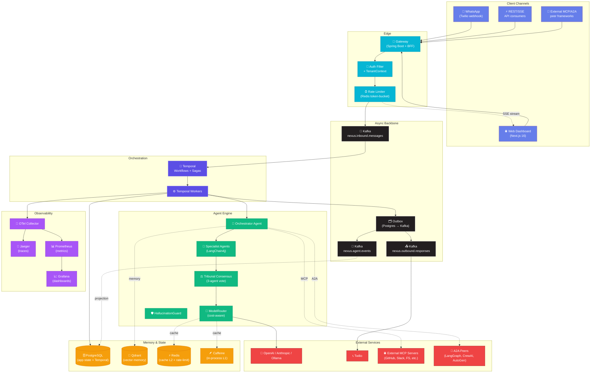
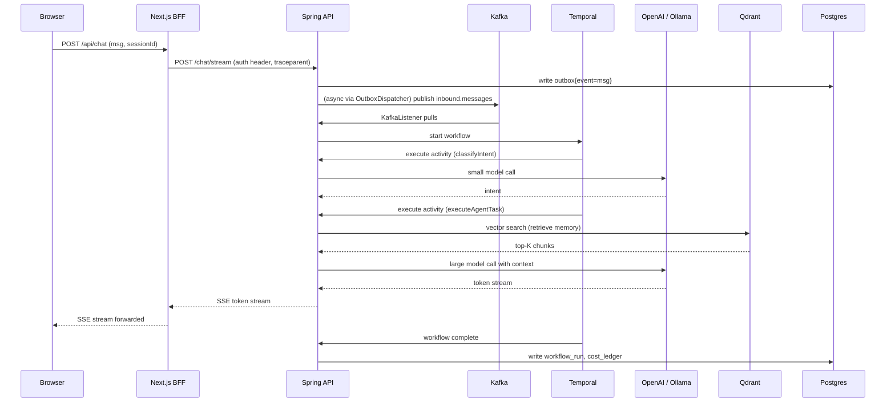
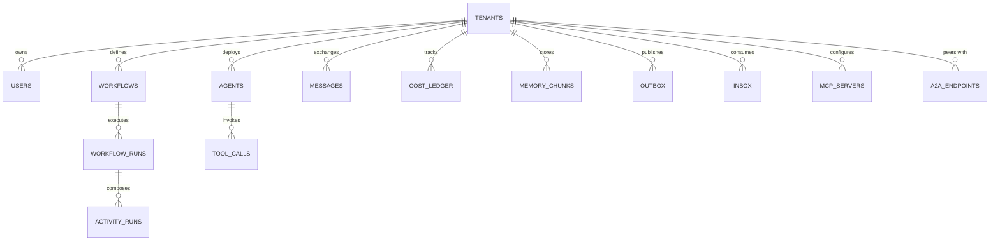

# Nexus OS — Technical Architecture

> **Companion to:** [`SYSTEM_DESIGN.md`](./SYSTEM_DESIGN.md) (concept catalog) and [`PRD.md`](./PRD.md) (product spec).
> **This document:** Walks through the concrete architecture — request flow, data flow, deployment topology, failure modes, scaling plan, security model.

---

## Table of Contents

1. [10,000-foot View](#1-10000-foot-view)
2. [Component Inventory](#2-component-inventory)
3. [Request Flow — End-to-End](#3-request-flow--end-to-end)
4. [Data Flow](#4-data-flow)
5. [Deployment Topology](#5-deployment-topology)
6. [Module Boundaries](#6-module-boundaries)
7. [Persistence Architecture](#7-persistence-architecture)
8. [Messaging Architecture](#8-messaging-architecture)
9. [AI Layer Architecture](#9-ai-layer-architecture)
10. [Frontend Architecture](#10-frontend-architecture)
11. [Observability Pipeline](#11-observability-pipeline)
12. [Scaling Plan](#12-scaling-plan)

---

## 1. 10,000-foot View



---

## 2. Component Inventory

| Component | Process | Default Port | Stateful? | HA Strategy |
|---|---|---|---|---|
| Backend (Spring Boot) | `nexus-os` JAR | 8081 | No | Replicate N pods; round-robin LB |
| Temporal Worker | Same JVM as backend (or separate worker process v0.3+) | — | No | N workers polling same task queue |
| Frontend (Next.js) | `npm run start` | 3000 | No | Vercel / CDN edge |
| PostgreSQL | `nexus-postgres` | 5432 | Yes | Primary + 2 replicas (v0.3+); Patroni for autofailover |
| Kafka (KRaft) | `nexus-kafka` | 9092 | Yes | 3-broker cluster + KRaft quorum (v0.3+) |
| Temporal Server | `nexus-temporal` | 7233 (gRPC), 8233 (HTTP) | Yes (backed by PG) | Stateless app shards; PG provides durability |
| Temporal UI | `nexus-temporal-ui` | 8080 | No | Stateless |
| Qdrant | `nexus-qdrant` | 6333 (REST), 6334 (gRPC) | Yes | Snapshot to S3 nightly; 3-node cluster in v1.0 |
| Redis | `nexus-redis` (v0.1 add) | 6379 | Cache only | Single instance is fine; cluster mode in v0.3+ |
| Jaeger | `nexus-jaeger` (v0.1 add) | 16686 (UI), 14268 (collector) | Yes (in-mem dev / Elasticsearch prod) | Single in dev; clustered backend in prod |
| Prometheus | `nexus-prometheus` (v0.1 add) | 9090 | Yes (TSDB) | Replicated pair + Thanos for long retention |
| Grafana | `nexus-grafana` (v0.1 add) | 3001 | Stateful (provisioned) | Single + Postgres state backend |
| OTel Collector | `nexus-otel-collector` (v0.1 add) | 4317 (gRPC), 4318 (HTTP) | No | DaemonSet in k8s |

---

## 3. Request Flow — End-to-End

### Example: WhatsApp user sends "draft me a follow-up email for prospect X"

```
[1] Twilio receives WhatsApp message
    ↓ HTTP POST
[2] /api/integrations/whatsapp/webhook  (Spring controller)
    ↓ verifies Twilio signature
    ↓ normalizes Twilio shape → InboundMessage record (Anti-Corruption Layer)
    ↓ resolves tenant via phone-number → tenants table
    ↓ writes to outbox (atomically with idempotency row in inbox_consumed)
    ↓ returns 200 immediately (sub-100ms)

[3] OutboxDispatcher  (Spring @Scheduled, 200ms tick)
    ↓ SELECT FROM outbox WHERE dispatched_at IS NULL LIMIT 100
    ↓ publishes to Kafka topic nexus.inbound.messages (key = tenant_id)
    ↓ UPDATE outbox SET dispatched_at = now()

[4] InboundMessageConsumer  (Spring @KafkaListener)
    ↓ inbox dedupe check (event_id PRIMARY KEY)
    ↓ extracts trace context from Kafka headers (OTel propagation)
    ↓ kicks off Temporal workflow:
       WorkflowClient.start(AgentOrchestrationWorkflow::orchestrate, ...)

[5] Temporal Workflow (AgentOrchestrationWorkflowImpl)
    ↓ Activity 1: classifyIntent(payload)  — small model, 0.1 temp
    ↓ Activity 2: routeToAgent(intent)     — deterministic switch
    ↓ Activity 3: executeAgentTask(agentId, payload)
        ├─ Tribunal.vote(payload) (if high-stakes) — N=3 parallel
        ├─ ModelRouter.selectModel(complexity) — cheap first
        ├─ PromptCache.get(key) — Caffeine then Redis then DB
        ├─ on cache miss: LangChain4j → OpenAiChatModel (or Ollama)
        ├─ HallucinationGuard.verify(response)
        ├─ CostMeter.record(tenant, tokens.in, tokens.out, usd)
        ├─ Memory.store(QdrantEmbedding) for RAG recall
        └─ returns response string

[6] Workflow writes outbound message to outbox
    ↓ OutboxDispatcher → Kafka nexus.outbound.responses

[7] OutboundResponseConsumer
    ↓ dispatches by channel:
        ├─ Twilio (WhatsApp)
        ├─ Slack
        └─ SSE stream (web dashboard live update)

[8] Throughout: every span is captured via OpenTelemetry
    ↓ OTel Collector → Jaeger (trace) + Prometheus (counter/histogram)
```

### Sequence Diagram (web chat path)



---

## 4. Data Flow

### 4.1 Write Path (the principle: never dual-write)

```
Service Action
    ↓
[1] BEGIN tx
[2] write domain table (workflow_runs / messages / cost_ledger)
[3] write outbox row (event payload + topic + key)
[4] COMMIT tx
    — both rows commit atomically; if step 2 or 3 fails, neither is visible

(asynchronous)

OutboxDispatcher
    ↓ poll outbox(dispatched_at IS NULL)
    ↓ publish to Kafka
    ↓ UPDATE outbox SET dispatched_at = now()
```

### 4.2 Read Path

| Resource | Cache Strategy | Source of Truth |
|---|---|---|
| Recent workflow runs (dashboard) | None (sub-second freshness needed) | Postgres replica |
| Cost rollups (daily totals) | Materialized view refreshed every 15 min | Postgres `cost_ledger` |
| Agent config | Redis L2 cache, TTL 5min, invalidated on write | Postgres `agents` |
| Prompt cache | Caffeine L1 → Redis L2 → Postgres L3 | computed from LLM (memoized) |
| Vector memory | None (Qdrant is itself fast) | Qdrant |
| Tenant metadata | Caffeine L1 (TTL 1min, with eviction on tenant update event) | Postgres `tenants` |

### 4.3 Schema Snapshot

See [`COORDINATION.md` §6](../COORDINATION.md) — full schema planned in `backend/src/main/resources/db/migration/V001-V006`.

Key tables and their roles:



---

## 5. Deployment Topology

### 5.1 Local Development (current — v0.1)

```
┌─────────────────────────────────────────────────────────────────┐
│  Developer Laptop                                                │
├─────────────────────────────────────────────────────────────────┤
│                                                                  │
│   docker compose up                                              │
│   ┌──────────┬──────────┬──────────┬──────────┬──────────┐     │
│   │ Postgres │  Kafka   │ Temporal │  Qdrant  │  Redis   │     │
│   │  :5432   │  :9092   │  :7233   │  :6333   │  :6379   │     │
│   └──────────┴──────────┴──────────┴──────────┴──────────┘     │
│   ┌──────────┬──────────┬──────────┐                            │
│   │  Jaeger  │Prometheus│ Grafana  │                            │
│   │  :16686  │  :9090   │  :3001   │                            │
│   └──────────┴──────────┴──────────┘                            │
│                                                                  │
│   mvnw spring-boot:run                npm run dev                │
│   ┌─────────────────────┐             ┌─────────────────────┐  │
│   │  Backend (Java 21)  │             │  Frontend (Next 16) │  │
│   │  http://localhost   │             │  http://localhost   │  │
│   │       :8081         │             │       :3000         │  │
│   └─────────────────────┘             └─────────────────────┘  │
│                                                                  │
└─────────────────────────────────────────────────────────────────┘
```

### 5.2 Production Topology (v0.3+)

```
                        Internet
                            │
                            ▼
                  ┌─────────────────────┐
                  │   CloudFront / CDN  │
                  └──────────┬──────────┘
                             │
                  ┌──────────▼──────────┐
                  │   AWS NLB / GLB     │
                  └──────────┬──────────┘
                             │
              ┌──────────────┼──────────────┐
              │              │              │
              ▼              ▼              ▼
        ┌────────┐     ┌────────┐     ┌────────┐
        │Frontend│     │Backend │     │Workflow│
        │ (k8s)  │     │ (k8s)  │     │Workers │
        │  3 pod │     │  6 pod │     │  4 pod │
        └────┬───┘     └───┬────┘     └───┬────┘
             │             │              │
             └──────┬──────┴──────────────┘
                    │
       ┌────────────┼────────────────────────────┐
       │            │                            │
       ▼            ▼                            ▼
  ┌────────┐  ┌─────────┐  ┌─────────┐  ┌────────┐  ┌────────┐
  │  Kafka │  │Postgres │  │ Temporal│  │ Qdrant │  │ Redis  │
  │ 3-brkr │  │primary+ │  │  cluster│  │ 3-node │  │cluster │
  │  +KRaft│  │ 2 rplca │  │  (PG)   │  │ cluster│  │        │
  └────────┘  └─────────┘  └─────────┘  └────────┘  └────────┘
                    │
                    ▼
       ┌─────────────────────────┐
       │  Observability Stack    │
       │  (Tempo / Loki /        │
       │   Prometheus / Grafana) │
       └─────────────────────────┘
```

### 5.3 Network Boundaries

- **Public**: LB (HTTPS only).
- **DMZ**: Backend pods.
- **Internal**: Postgres, Kafka, Temporal, Qdrant, Redis — never exposed to internet.
- **Inter-pod**: mTLS via service mesh (Istio/Linkerd v0.3+).
- **Egress**: Only to allow-listed providers (OpenAI, Anthropic, Twilio, hosted MCP/A2A). Egress proxy logs all calls.

---

## 6. Module Boundaries

Inside the monolith, modules are kept clean so they can be peeled into separate services later (Strangler Fig).

```
com.nexus.os
├── NexusOsApplication
├── config/                    # cross-cutting Spring config beans
│   ├── TemporalConfig
│   ├── KafkaConfig
│   ├── RedisConfig            (v0.1)
│   ├── QdrantConfig           (v0.1)
│   ├── ObservabilityConfig    (v0.1)
│   ├── ResilienceConfig       (v0.1)
│   └── SecurityConfig         (v0.1)
├── domain/                    # entities + repositories (v0.1)
│   └── { Tenant, Agent, Workflow, WorkflowRun, ActivityRun, ToolCall,
│         Message, CostLedger, OutboxEvent, InboxEvent, MemoryChunk }
├── agents/                    # AI engine — Gemini's lane
│   ├── AgentCapability        # sealed interface
│   ├── NexusAgent             # LangChain4j wrapper
│   ├── ModelRouter            (v0.1)
│   ├── PromptCache            (v0.1)
│   ├── HallucinationGuard     (v0.1)
│   ├── Tribunal               (v0.1)
│   └── rag/
│       ├── ChunkingStrategy
│       ├── EmbeddingService
│       ├── QdrantStore
│       └── Retriever
├── temporal/                  # durable workflows — Claude's lane
│   ├── workflows/
│   │   ├── AgentOrchestrationWorkflow
│   │   ├── AgentOrchestrationWorkflowImpl
│   │   └── templates/         (v0.2 — workflow library)
│   └── activities/
│       ├── AgentActivity
│       ├── AgentActivityImpl
│       └── compensations/     (v0.1)
├── kafka/                     # streaming layer — Helper's lane (config); Claude's (code)
│   ├── InboundMessageConsumer
│   ├── AgentEventProducer
│   ├── OutboundResponseProducer
│   ├── OutboxDispatcher
│   └── KafkaTracingInterceptor (v0.1)
├── integrations/              # external systems — Cursor's lane
│   ├── whatsapp/{TwilioClient, MockWhatsAppClient, WhatsAppWebhookController}
│   ├── mcp/{McpServerExporter, McpClient}
│   └── a2a/{A2AServer, A2AClient}
├── api/                       # HTTP surface — Claude's lane
│   ├── controller/
│   ├── dto/
│   └── error/GlobalExceptionHandler
├── tenancy/                   # multi-tenancy — Claude's lane
│   ├── TenantContext
│   ├── TenantFilter
│   └── RlsAspect
├── observability/             # tracing/metrics aspects — Claude's lane
│   ├── MetricsCustomizer
│   ├── TracingAspect
│   └── AuditLogger
└── billing/                   # cost meter — Claude's lane
    └── CostMeter
```

---

## 7. Persistence Architecture

### 7.1 Schema Evolution Policy

- Flyway migrations are append-only (`V001`, `V002`, ...). Never edit a committed migration.
- Migrations are **additive-first**: add columns nullable, add tables, add indexes — never drop in the same migration that introduces deps.
- A migration that needs to drop a column ships in two phases:
  1. `Vn__deprecate_col_X.sql` — code stops writing; reads tolerate null
  2. `V(n+1)__drop_col_X.sql` — DROP after backfill confirmed clean

### 7.2 Transactional Boundaries

- A single HTTP request opens at most one DB transaction (`@Transactional` on the @Service method).
- Long-running work (workflows) does **not** hold transactions — each activity is its own transaction.
- Read-only paths use `@Transactional(readOnly = true)` to enable replica routing.

### 7.3 Row-Level Security

Every tenant-scoped table has a policy:

```sql
CREATE POLICY tenant_isolation ON workflow_runs
  USING (tenant_id = current_setting('app.current_tenant')::uuid);

ALTER TABLE workflow_runs ENABLE ROW LEVEL SECURITY;
```

The JDBC connection wrapper runs `SET LOCAL app.current_tenant = ?` at the start of every request transaction (driven by `TenantContext`).

---

## 8. Messaging Architecture

### 8.1 Topic Map

| Topic | Producer(s) | Consumer(s) | Key | Partitions | Retention |
|---|---|---|---|---|---|
| `nexus.inbound.messages` | Webhooks (WhatsApp, Slack); API gateway | `InboundMessageConsumer` (Temporal kickoff) | `tenant_id` | 3 dev / 12 prod | 7 days |
| `nexus.agent.events` | Temporal activities (workflow status) | CQRS projector → PG; SSE pump → WebSocket | `workflow_run_id` | 6 dev / 24 prod | 1 day |
| `nexus.outbound.responses` | Workflow output activity | Channel routers (WhatsApp, Slack, SSE) | `tenant_id` | 3 dev / 12 prod | 1 day |
| `nexus.dlq` | All consumers (poisoned messages) | Manual ops / replay tool | none | 1 | 30 days |

### 8.2 Producer Settings

```properties
acks=all                              # quorum durability
enable.idempotence=true               # exactly-once semantics inside one session
compression.type=zstd
max.in.flight.requests.per.connection=5
retries=Integer.MAX_VALUE
delivery.timeout.ms=120000
```

### 8.3 Consumer Settings

```properties
enable.auto.commit=false              # manual ack only
auto.offset.reset=earliest            # never lose unprocessed history on rebalance
max.poll.records=10                   # bound batch for back-pressure
isolation.level=read_committed
```

### 8.4 Why Kafka (and not Rabbit / SQS / NATS)

| Need | Kafka | RabbitMQ | SQS | NATS JetStream |
|---|---|---|---|---|
| Log replay (debugging + reprocessing) | ✅ | ❌ | ❌ | ✅ |
| Ordered per-key | ✅ (partition key) | partial | partial | ✅ |
| 100K+ msg/s | ✅ | ~30K | OK | ✅ |
| Multi-consumer pull | ✅ (groups) | ❌ (push) | ✅ | ✅ |
| Operational maturity in JVM | ✅ | ✅ | n/a | medium |

**Decision recorded in:** [`docs/ADRS/0003-kafka-kraft-over-zookeeper.md`](./ADRS/0003-kafka-kraft-over-zookeeper.md) (planned).

---

## 9. AI Layer Architecture

### 9.1 The Agent Pipeline

```
User Query
    ↓
[1] IntentClassifier (small model, fast)
    ↓ produces intent label
[2] AgentRouter (deterministic switch)
    ↓ selects specialist
[3] Pre-flight checks:
       - Tribunal needed? (high-stakes ⇒ yes)
       - Budget OK? (CostMeter.canSpend)
       - Cache hit? (PromptCache)
[4] Specialist agent invocation:
       - RAG retrieval (if DataRetrieval capability)
       - Tool list assembly (built-in + MCP-imported)
       - LLM call via ModelRouter
[5] Post-flight:
       - HallucinationGuard verifies output
       - CostMeter records consumption
       - Memory.store updates Qdrant with new context
       - response → SSE / Kafka outbound
```

### 9.2 Agent Capability Sealed Hierarchy

```java
sealed interface AgentCapability permits
    TextGeneration, CodeExecution, DataRetrieval, ImageAnalysis,
    AudioTranscription /* future */, WorkflowComposition /* future */ {
  // pattern-matching switch in NexusAgent#execute
}
```

Adding a capability is a 3-step change:
1. Add a record to the sealed hierarchy.
2. Add a `case` branch in `NexusAgent#execute` (compiler will demand it — exhaustiveness check).
3. Add tool definitions to expose it via MCP.

### 9.3 Tool Discovery (MCP-style)

- Built-in tools are declared via annotations on Spring beans:
  ```java
  @McpTool(name = "search_memory", description = "...")
  public List<MemoryChunk> searchMemory(@McpParam("query") String q) { ... }
  ```
- `McpServerExporter` scans for `@McpTool` at startup and exposes them via MCP `tools/list`.
- `McpClient` connects to configured external MCP servers per tenant and merges their tools into the LangChain4j tool spec.

### 9.4 A2A Federation

- Nexus exposes its agents at `/.well-known/agent.json` with capability manifest.
- `A2AClient` can call peer agents (LangGraph, CrewAI, AutoGen) via the standard A2A invocation envelope.
- A workflow can be **federated**: "summarize this doc using our Nexus summarizer, then send to CrewAI research team for fact-check, then back to our Outreach agent for drafting".

---

## 10. Frontend Architecture

### 10.1 Next.js 16 App Router Layout

```
frontend/src/app/
├── layout.tsx                 # root layout (fonts, providers)
├── globals.css                # design tokens
├── page.tsx                   # public dashboard (existing)
├── (marketing)/page.tsx       # public landing (v0.2)
├── (app)/                     # authenticated zone
│   ├── layout.tsx             # sidebar + tenant switcher + topbar
│   ├── studio/                # Agent Studio (React Flow editor)
│   ├── agents/                # agent list + detail
│   ├── workflows/             # workflow list + detail + replay
│   ├── runs/                  # run history
│   ├── observability/         # Grafana embed
│   ├── cost/                  # cost ledger viz
│   ├── memory/                # vector memory browser
│   ├── integrations/          # MCP + A2A config
│   └── settings/
└── api/                       # BFF — proxies to backend
    ├── chat/route.ts          # SSE streaming
    ├── agents/route.ts
    ├── workflows/route.ts
    └── observability/route.ts
```

### 10.2 Rendering Strategy

- **Default:** React Server Components (RSC) — render on the Next server, ship HTML.
- **Interactive pieces:** `"use client"` directive only where needed (forms, React Flow canvas, SSE subscriptions).
- **Streaming:** SSE for chat/agent output; React Suspense for slow page sections.

### 10.3 State Management

- **Server state:** Server Components fetch directly. No client-side cache library for read-only pages.
- **Interactive state:** React Server Actions for mutations. React's built-in `useState` / `useReducer` for component-local state.
- **Real-time:** SSE subscription hook in `lib/sse.ts` for live updates (workflow status, agent events).

### 10.4 React Flow Agent Canvas

- `frontend/src/components/AgentCanvas.tsx` is the centerpiece visualization.
- v0.1: static mock data.
- v0.2: live data fed via SSE from `/api/agents/graph/stream`.
- v0.3 (Agent Studio): drag-drop editing → POST changes back to the BFF → updates Workflow definitions.

---

## 11. Observability Pipeline

```
Application code (annotated with @Observed / @Timed / @Counted)
    ↓
Micrometer (in-process meter registry)
    ↓ scraped every 15s by Prometheus  → Grafana dashboards
    ↓ pushed via OTLP → OTel Collector  → Prometheus
                                        → Jaeger (traces)
                                        → Loki (logs, v0.3+)

OpenTelemetry SDK (auto-instrumentation for Spring + JDBC + Kafka + HTTP client)
    ↓ Trace context propagates via:
         - HTTP traceparent headers
         - Kafka producer record headers
         - Temporal workflow execution context
         - Database connection (logged with span id)
```

### 11.1 Default Dashboards (Grafana)

1. **Tenant Cost Overview**: USD/day per tenant, top-spender table, projected month.
2. **Workflow Health**: success/failure rate, p50/p95/p99 latency, retry count.
3. **Agent Quality**: tribunal disagreement rate, hallucination-guard rejections, fallback escalations.
4. **Infrastructure**: CPU/mem per pod, Kafka consumer lag, Postgres connections.
5. **External Dependencies**: OpenAI latency + error rate, Twilio delivery rate, Qdrant query time.

### 11.2 SLOs (target)

| Indicator | SLO |
|---|---|
| API availability | 99.5% (v0.1 dev), 99.9% (v1.0) |
| Workflow completion (P95) | < 30s |
| LLM call P95 | < 5s |
| Cost-meter write lag | < 10s |
| Inbox dedupe latency | < 50ms |
| Outbox dispatch lag | < 1s |

---

## 12. Scaling Plan

### Phase 1 — single node (v0.1 demo)
- 1 backend pod, 1 worker, 1 Postgres, 1 Kafka, 1 Qdrant.
- Handles tens of users, hundreds of workflows/day.
- Bottleneck: LLM provider quota.

### Phase 2 — replicated services (v0.3 internal beta)
- 3–6 backend pods behind LB.
- 1 PG primary + 2 replicas.
- 3-broker Kafka.
- 3-node Qdrant.
- Handles thousands of users, ~50K workflows/day.
- Bottleneck: PG write IOPS on `workflow_runs` + `cost_ledger`.

### Phase 3 — sharded by tenant (v1.0)
- Service split: orchestrator vs agent-engine vs integrations vs billing.
- PG sharded by `hash(tenant_id) % N` for `messages` + `cost_ledger`.
- Kafka with 24+ partitions for high-throughput topics.
- Multi-region (read-local, write-home).
- Bottleneck: cost — focus shifts to optimization (better caching, smaller models).

### Auto-scaling triggers
- HPA on backend: target CPU 60%, scale 2–20 pods.
- HPA on workers: target Kafka consumer lag < 100, scale 2–10 pods.
- Postgres replicas: manual scale + reader-router; lag-aware load balancing.

---

## Appendix A — Why this architecture (capstone-tier summary)

If you must explain Nexus OS in one paragraph:

> Nexus OS is a Java 21 Spring Boot monolith with strict modular boundaries, orchestrated by Temporal for durable execution and Kafka for async fan-out. Stateless services scale horizontally; Postgres holds source-of-truth state with row-level multi-tenancy and a transactional outbox for cross-service events; Qdrant holds vector memory for RAG; Redis is the L2 cache and rate-limiter store. The AI layer is a cost-aware orchestrator that delegates to specialist agents (LangChain4j) with hallucination guards, multi-agent tribunal consensus, and per-tenant budget circuit breakers. Standards-first interop (MCP for tools, A2A for cross-framework agents) lets Nexus participate in the broader 2026 agentic ecosystem instead of being a walled garden. Observability (Micrometer + OpenTelemetry + Jaeger + Prometheus + Grafana) is wired in from day one — every workflow is traceable end-to-end, every dollar of LLM spend is metered, every cache miss is counted.

That paragraph maps to ~40 named system-design concepts. Walk it through during the capstone defense and you cover the entire syllabus.
